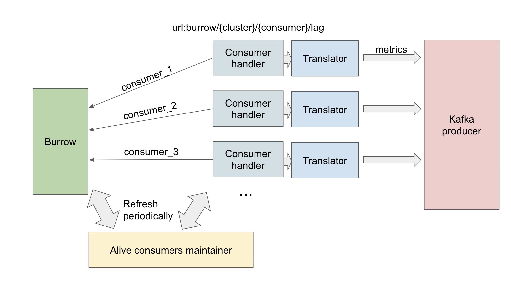

# goRainbow
# What it is
goRainbow is a plug-in for [Burrow](https://github.com/linkedin/Burrow). It pulls lag information from Burrow, translates it into metrics and sends it to the wavefront.
1. It pulls lag of consumers.
2. It pulls offset of topics.
3. It provides data traffic statistic.(totalMessage, validMessage, metricsSent)
### Features
1. Heath-check: It provides health-check HTTP service so that AWS can auto restart Burrow-goRainbow when the service is unavailable.
2. Dynamic metric sending:
   1. It sends partition metrics when lag exists. Also it guarantees every metric starts from 0 and ends with 0, which shows better in wavefront.
   2. It sends metrics per 30s when metrics change and per 60s for unchanged metrics.
## Thanks
A big thanks to porter-rainbow, which gave a basic idea about how to design the goRainbow.

port-rainbow is mainly based on socket connection. goRainbow is like a RESTful service.
# Rainbow structure

1. Each `consumer handler` is responsible for one consumer and has one specific url(`burrow/{cluster}/{consumer}`) to pull the consumer info from Burrow.
2. `alive consumers maintainer` checks Burrow periodically to see whether there is a new consumer or not. If so, it would raise a new `consumer handler` for the new consumer.
3. `consumer handler` would deregister itself in `alive consumers maintainer` when its consumer is not valid any longer.
# Metrics format
### Consumer level
1. consumer totalLag:
   - "fjord.burrow.${env}.${consumer}.totalLag ${totalLag} ${timestamp} ${tags}"
2. consumer maxLag partition:
   - "fjord.burrow.${env}.${consumer}.maxLagmaxLagPartitionID ${value} ${timestamp} ${tags}"
   - "fjord.burrow.${env}.${consumer}.maxLagCurrentLag ${value} ${timestamp} ${tags}"
   - "fjord.burrow.${env}.${consumer}.maxLagStartOffset ${value} ${timestamp} ${tags}"
   - "fjord.burrow.${env}.${consumer}.maxLagEndOffset ${value} ${timestamp} ${tags}"
   - "fjord.burrow.${env}.${consumer}.maxLagTopic ${value} ${timestamp} ${tags}"
3. consumer all paritions(when totalLag is above 0):
   - "fjord.burrow.${env}.${consumer}.${partitionId}.currentLag ${value} ${timestamp} ${tags}"
   - "fjord.burrow.${env}.${consumer}.${partitionId}.startOffset ${value} ${timestamp} ${tags}"
   - "fjord.burrow.${env}.${consumer}.${partitionId}.endOffset ${value} ${timestamp} ${tags}"
### Topic level
- Topic level offset shows the kafka-producer offset in each partition.
   - "fjord.burrow.${env}.topic.${partitionId}.offset ${value} ${timestamp} ${tags}"
# High-level
goRainbow includes 3 main parts:
1. URL maintainer: maintain available URLs, create new handler thread for new URL.
2. URL handler: translates data into required form, prepared for producer.
3. kafka producer: sends data to kafka(speed-racer), which will send metrics to the Wavefront.
# Usage
### For Burrow
You may check [Burrow Dockerfile](burrow/Dockerfile) for how to use goRainbow.
Also, [Burrow Inspection](burrow/README.md) is my understanding of Burrow code.
### Program
The main program is goRainbow.go
```
go run goRainbow.go
```
It will open health_check port at localhost:7099
- health-check: localhost:7099/health-check
  - return 200 if service is available
  - return 503 if service is unavailable
### Burrow push-model
Also goRainbow provides a Burrow-push-model, in which goRainbow accepts Burrow's Lag message via Burrow notifier. It's working fine, but goRainbow pull-model can provide a better precision.   
You may check rainbow-push-model branch for details. [push-model](https://github.com/HarbinZhang/goRainbow/tree/rainbow-push-model)
### Some implements
1. Avoid blocking operation in main pipeline.
   1. Refined nested sync map to avoid blocking in URL maintainer.
   2. leave heavy workload to goroutine.
2. Twin-state-machine to guarantee metrics start and end with 0.