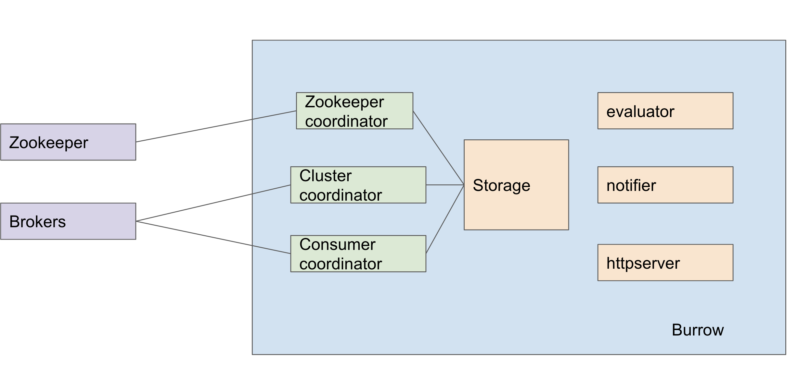

# Introduction
Burrow is a monitoring companion for Apache Kafka that provides consumer lag checking as a service without the need for specifying thresholds. It monitors committed offsets for all consumers and calculates the status of those consumers on demand. An HTTP endpoint is provided to request status on demand, as well as provide other Kafka cluster information. There are also configurable notifiers that can send status out via email or HTTP calls to another service.

# High level
Burrow includes seven coordinators and two main channels(evaluator + storage):

This is how burrow communicates internally:
1. Consumers and Clusters send offsets to the storage coordinator to populate all the state information.
2. The Notifiers send evaluation requests to the evaluator coordinator to check group status.
3. The Evaluators send requests to the storage coordinator for group offset and lag information.
4. The HTTP server sends requests to both the evaluator and storage coordinators to fulfill API requests.

# Impact to Kafka cluster
1. Zookeeper Coordinator would create a path in zookeeper("/burrow"), which can be used by other subsystems to store metadata or coordinate operations between multiple Burrow instances.
2. Cluster Coordinator would periodically fetch the broker end offset (latest offset) for each partition. (Using TCP connection with brokers)
3. Consumer Coordinator would get consumer group information from the offsets topic** in the cluster, which is typically __consumer_offsets. 

# Details in implementation
- Cluster Coordinator:

// GetAvailableOffsets sends an OffsetRequest to the broker and returns the OffsetResponse that was received
brokers[brokerID].GetAvailableOffsets(*sarama.OffsetRequest) (*sarama.OffsetResponse, error)
It's from Burrow/core/internal/cluster/kafka_cluster.go, which calls broker TCP connection to get offsets.

# Version support
For zookeeper related package: sarama used here, it supports Kafka 2.0, Sarama provides a "2 releases + 2 months" compatibility guarantee. From its github page: https://github.com/Shopify/sarama

For burrow, it supports Kafka 1.0 from its latest release. https://github.com/linkedin/Burrow/releases

If we will upgrade Kafka to a newer version, I can do a local test quickly to find out whether burrow supports the newer version or not.

# Coordinator level
## Consumer Coordinator
1. What it is

The consumer subsystem is responsible for getting consumer offset information and sending that information to the storage subsystem.

2. Includes

    1. Coordinator: manage all consumer modules.
    2. Kafka_client: a consumer module consumes __consumer_offsets.
    3. kafka_zk_client: a consumer module for old Kafka version. Parse the /consumers tree of a Kafka cluster's metadata to get consumer information (old consumer)
#### Kafka_client
KafkaClient is a consumer module which connects to a single Apache Kafka cluster and reads **consumer group information from the offsets topic** in the cluster, which is typically __consumer_offsets. The messages in this topic are decoded and the information is forwarded to the storage subsystem for use in evaluations.

3. Process

    1. Start consumer module:
        1. Connect Kafka client: Do an initial fetch of all cluster metadata by specifying an empty list of topics. (**Still not understand**)
        2. Start consumers, one consumer per partition.
        3. Process consumer offset message when msg reach the es consumer. Handling msg by buffer read. Include the ng decode process.
    2. Start all consumer modules.

## Cluster Coordinator
1. What it is
A "cluster" is a single Kafka cluster that is going to be monitored by Burrow. The cluster module is responsible for connecting to the Kafka cluster, monitoring the **topic list, and periodically fetching the broker end offset (latest offset) for each partition.** This information is sent to the storage subsystem, where it can be retrieved by the evaluator and HTTP server.
2. Process
    1. Connect Kafka client
    2. Fire off the offset req once, before starting the ticker, to prepare good data for consumers to start.
    3. Start the main loop that has a timer for offset and topic fetches.

## Zookeeper Coordinator
1. What it is
The zookeeper subsystem provides a Zookeeper client that is common across all of Burrow, and can be used by other subsystems to store metadata or coordinate operations between multiple Burrow instances.
2. Process
    1. Create path in zookeeper(“/burrow”)
    2. mainloop( <-chan connEventChan) (**Still not understand**)

 